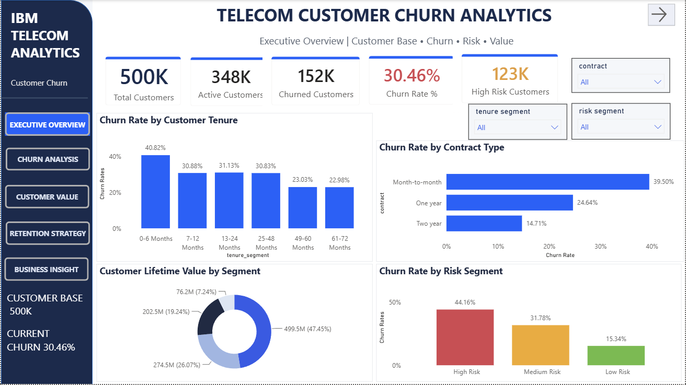
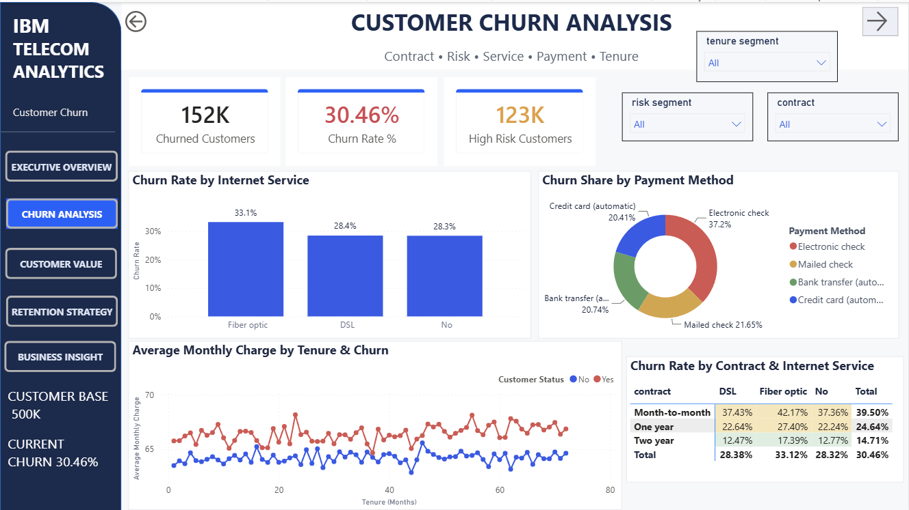
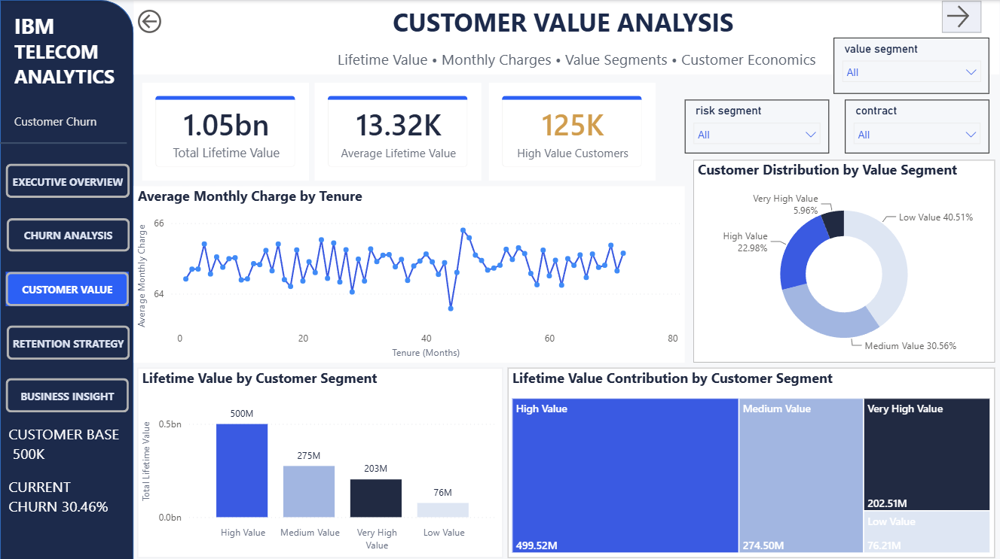
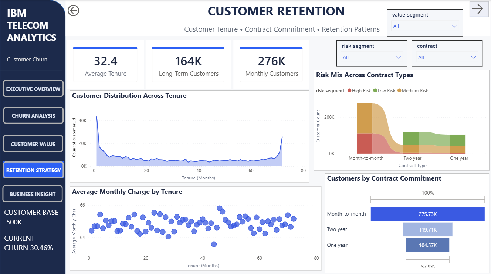
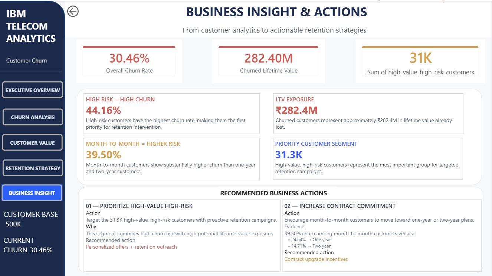

# 📊 Telecom Customer Churn Analytics

An end-to-end **Telecom Customer Churn Analytics** project built to analyze customer churn, identify high-risk and high-value customer segments, quantify customer lifetime-value exposure, and generate data-driven retention strategies.

The project follows a complete analytics workflow:

**Raw Data → Python ETL → PostgreSQL → SQL Analysis → Power BI → Business Insights**

## 🎯 Business Problem

Customer churn is a major challenge for telecom companies because losing customers directly affects recurring revenue and long-term customer value.

The objective of this project is to analyze customer behavior and identify the factors and segments associated with churn.

The analysis focuses on answering the following business questions:

- What is the overall customer churn rate?
- Which contract types have the highest churn?
- Which customer risk segments are most likely to churn?
- How does customer tenure relate to monthly charges?
- Which customers have high lifetime value?
- Which customers are both high-value and high-risk?
- How much lifetime value is associated with customers who have churned?
- Which customer segments should be prioritized for retention?
- What actions can the business take to reduce churn and protect customer lifetime value?

## 🎯 Project Objectives

The main objectives of this project are to:

- Build an end-to-end data analytics workflow from raw data to business insights.
- Develop a structured ETL pipeline using Python.
- Store and manage transformed data using PostgreSQL.
- Organize the data into Bronze, Silver, and Gold layers.
- Use SQL to perform customer churn, risk, contract, and lifetime-value analysis.
- Develop meaningful KPIs and analytical measures using Power BI and DAX.
- Build an interactive multi-page Power BI dashboard for customer analysis.
- Identify high-risk and high-value customer segments.
- Quantify the financial impact of customer churn.
- Translate analytical findings into actionable customer retention strategies.

  ## 🛠️ Tech Stack

| Technology | Purpose |
|---|---|
| **Python** | ETL, data validation, cleaning and transformation |
| **Pandas** | Data manipulation and transformation |
| **PostgreSQL** | Data storage and analytical database |
| **SQL** | Data analysis, KPI calculations and customer segmentation |
| **Power BI** | Interactive dashboard and data visualization |
| **DAX** | Business measures and KPI calculations |
| **Git & GitHub** | Version control and project management |

## 🔄 Project Workflow

The project follows an end-to-end data analytics workflow:

``
Raw Dataset
     │
     ▼
Python ETL
     │
     ├── Extract
     ├── Validate
     ├── Transform
     └── Load
     │
     ▼
PostgreSQL
     │
     ├── Bronze Layer
     │      └── Raw Data
     │
     ├── Silver Layer
     │      └── Cleaned & Transformed Data
     │
     └── Gold Layer
            └── Business-Ready Analytical Data
                    │
                    ▼
                SQL Analysis
                    │
                    ▼
                 Power BI
                    │
                    ├── Executive Overview
                    ├── Churn Analysis
                    ├── Customer Value
                    ├── Customer Retention
                    └── Business Insights & Actions

## 🗄️ Data & PostgreSQL Architecture

The project uses PostgreSQL as the analytical database and follows a layered data architecture:

**Bronze → Silver → Gold**

This structure separates raw data from cleaned data and business-ready analytical data.

### 🥉 Bronze Layer

The Bronze layer stores the raw customer data with minimal transformation.

**Purpose:**

- Preserve the original source data
- Maintain data traceability
- Provide a reliable raw-data layer
- Support reproducibility of the ETL process

### 🥈 Silver Layer

The Silver layer contains cleaned and transformed customer-level data.

**Transformations include:**

- Data cleaning and standardization
- Data validation
- Churn-related fields
- Customer risk segmentation
- Customer value segmentation
- Lifetime-value calculations
- Analytical flags and derived fields

The Silver layer serves as the primary customer-level analytical dataset.

### 🥇 Gold Layer

The Gold layer contains business-ready analytical data created from the Silver layer.

**Purpose:**

- KPI analysis
- Customer segmentation
- Churn analysis
- Lifetime-value analysis
- Risk analysis
- High-value/high-risk customer analysis
- Power BI reporting

The Gold layer provides summarized and analysis-ready data for business reporting and decision-making.

### Data Flow

``
Raw Customer Data
        │
        ▼
   Bronze Layer
        │
        ▼
   Silver Layer
        │
        ▼
    Gold Layer
        │
        ▼
   SQL Analysis
        │
        ▼
    Power BI

    ## 🧮 SQL Analysis

SQL was used to transform the cleaned customer data into meaningful business insights and KPIs.

The analysis was performed primarily on the Silver and Gold layers of the PostgreSQL database.

### SQL Techniques Used

- `SELECT`
- `WHERE`
- `GROUP BY`
- `HAVING`
- `CASE WHEN`
- `COUNT`
- `COUNT(DISTINCT customer_id)`
- `SUM`
- `AVG`
- Conditional aggregation
- Common Table Expressions (CTEs)
- Subqueries
- Percentage calculations
- Customer segmentation
- KPI calculations

### Key SQL Analysis Areas

#### Customer Churn Analysis

Calculated overall churn and analyzed churn across different customer segments.

#### Contract Analysis

Compared churn rates across:

- Month-to-month
- One year
- Two year

#### Risk Analysis

Calculated churn rates across:

- Low Risk
- Medium Risk
- High Risk

#### Customer Value Analysis

Analyzed customer lifetime value to identify financially important customers.

#### High-Value / High-Risk Analysis

Combined customer value and risk segments to identify customers who have both:

- High lifetime value
- High churn risk

This helped identify priority customers for retention strategies.

### Analytical Approach

The SQL analysis follows this general process:

``
Cleaned Silver Data
        │
        ▼
   SQL Filtering
        │
        ▼
   Aggregations
        │
        ▼
Customer Segmentation
        │
        ▼
       KPIs
        │
        ▼
 Business Insights

 ## 📊 Power BI Dashboard

The final Power BI report contains **five interactive pages**, designed to move from high-level business performance to detailed customer analysis and actionable recommendations.

### 1️⃣ Executive Overview

Provides a high-level view of the overall customer base.

**Key areas:**

- Total customers
- Churn rate
- Active and churned customers
- Customer risk distribution
- Contract distribution
- Executive-level KPIs

**Business question answered:**

> What is the overall state of the customer base?

---

### 2️⃣ Churn Analysis

Focuses on identifying customer groups with higher churn.

**Key areas:**

- Churn by contract type
- Churn by risk segment
- Churn distribution
- Customer churn patterns
- Comparative churn analysis

**Business question answered:**

> Which customer segments have the highest churn?

---

### 3️⃣ Customer Value

Focuses on the financial importance of customers.

**Key areas:**

- Total lifetime value
- Average lifetime value
- High-value customers
- Customer value segmentation
- Lifetime-value analysis
- Tenure and monthly-charge relationship

**Business question answered:**

> Which customers are most valuable to the business?

---

### 4️⃣ Customer Retention

Focuses on customer lifecycle, contract commitment and retention patterns.

**Key areas:**

- Customer tenure analysis
- Contract commitment
- Tenure vs monthly charges
- Risk distribution
- Customer retention patterns

**Business question answered:**

> Which customer characteristics are associated with retention risk?

---

### 5️⃣ Business Insights & Actions

The final page converts analytical findings into business recommendations.

**Key areas:**

- High-value/high-risk customer segment
- Churn-related financial exposure
- Priority retention opportunities
- Recommended business actions

**Business question answered:**

> What should the business do based on the analysis?

---

## 🎛️ Dashboard Interactivity

The dashboard includes interactive slicers and synchronized filtering to allow users to explore customer segments dynamically.

### Contract

Users can analyze:

- Month-to-month
- One year
- Two year

### Risk Segment

Users can analyze:

- Low Risk
- Medium Risk
- High Risk

### Value Segment

Users can analyze customers based on their value classification where applicable.

The dashboard uses synchronized slicers across the analytical pages so users can maintain consistent filtering while exploring different aspects of the customer base.

---

## 🎨 Dashboard Design

The report follows a consistent visual design system across all pages.

### Primary Colors

- **Primary Blue:** `#2F5BEA`
- **Dark Navy:** `#1F2A44`
- **Background:** `#F7F8FA`
- **Card Background:** `#FFFFFF`
- **Border:** `#E5E7EB`
- **Secondary Text:** `#667085`

### Risk Colors

- **Low Risk:** `#70AD47`
- **Medium Risk:** `#D99A3D`
- **High Risk:** `#D9534F`

The dashboard uses multiple visualization types rather than relying on a single chart type, allowing different analytical questions to be communicated clearly.

## 🔍 Key Business Insights

The analysis identified several important patterns in customer churn, customer risk and lifetime value.

### 1. High-Risk Customers Have Significantly Higher Churn

High-risk customers have a churn rate of **44.16%**, compared with **15.34%** for low-risk customers.

This indicates that risk-based customer prioritization can help the business focus retention efforts on customers who are more likely to churn.

---

### 2. Month-to-Month Customers Have the Highest Churn

| Contract Type | Churn Rate |
|---|---:|
| Month-to-month | **39.50%** |
| One year | **24.64%** |
| Two year | **14.71%** |

Month-to-month customers show substantially higher churn than customers with longer-term contracts.

This suggests that increasing long-term contract adoption could be an important retention opportunity.

---

### 3. Customer Churn Has Significant Financial Impact

Approximately **₹282.4M** in lifetime value is associated with customers who have already churned.

This shows that churn should not be evaluated only by customer count. It also represents a significant financial impact on customer lifetime value.

---

### 4. High-Value / High-Risk Customers Are a Priority Segment

The analysis identified approximately **31.3K customers** who are both high-value and high-risk.

This segment is particularly important because it combines:

**High customer value + High churn risk**

These customers should receive priority in proactive retention campaigns.

---

## 💡 Recommended Business Actions

### Action 1 — Prioritize High-Value High-Risk Customers

Target high-value/high-risk customers with proactive retention strategies before they churn.

**Recommended strategies:**

- Personalized retention offers
- Proactive customer outreach
- Early-warning alerts
- Customer-specific incentives
- Priority support for valuable customers

**Business objective:**

Reduce churn among financially important customers and protect customer lifetime value.

---

### Action 2 — Increase Long-Term Contract Adoption

Encourage month-to-month customers to move toward longer-term contracts.

**Recommended strategies:**

- Contract upgrade incentives
- Loyalty benefits
- Annual plan discounts
- Personalized upgrade campaigns
- Long-term customer rewards

**Business objective:**

Increase customer commitment and reduce the higher churn associated with month-to-month contracts.

## 📁 Repository Structure
``
telecom-churn-analytics/
│
├── data/
│   ├── cleaned/
│   ├── processed/
│   ├── raw/
│   └── synthetic/
│
├── docs/
│
├── notebooks/
│   ├── 01_Business_Understanding
│   ├── 02_Data_Cleaning
│   ├── 03_Exploratory_Data_Analysis
│   ├── 04_Feature_Engineering
│   └── 05_Synthetic_Data_Generation
│
├── powerbi/
│   └── telecom_churn_analytics_Dashboard
│
├── python/
│   ├── config
│   ├── extract
│   ├── load
│   ├── main
│   ├── transform
│   └── validate
│
├── screenshots/
│   ├── executive_overview.png
│   ├── churn_analysis.png
│   ├── customer_value.png
│   ├── customer_retention.png
│   └── business_insights.png
│
├── sql/
│   ├── 01_schema_creation.sql
│   ├── 02_ETL_load_verification.sql
│   ├── 03_Gold_Schema.sql
│   ├── 04_business_analysis.sql
│   └── 05.sql
│
├── .gitignore
└── README.md

## 📸 Dashboard Preview

### Executive Overview

### Churn Analysis

### Customer Value

### Customer Retention

### Business Insights & Actions

## 🚀 Project Outcome

This project demonstrates how raw telecom customer data can be transformed into a complete business analytics solution.

The workflow covers:

**Data → ETL → Database → SQL → Dashboard → Insights → Business Actions**

The final solution helps the business:

- Identify customers at high risk of churn
- Understand churn patterns across customer segments
- Identify financially valuable customers
- Quantify lifetime-value exposure
- Prioritize customer retention opportunities
- Translate analytical findings into actionable business strategies

  ## 🔒 Data Note

The raw telecom customer dataset is not included in the repository where size, licensing, or redistribution restrictions apply.

The repository focuses on the **ETL pipeline, PostgreSQL data architecture, SQL analysis, Power BI implementation, dashboard screenshots, and business insights**.

## 👨‍💻 Author

### Akhilesh Desai

**Aspiring Data Analyst | SQL | Python | Power BI | PostgreSQL**

### Skills Demonstrated

`Python` `Pandas` `SQL` `PostgreSQL` `Power BI` `DAX` `ETL` `Data Analytics` `Business Analytics`

## ⭐ Project Summary

> An end-to-end Telecom Customer Churn Analytics project combining **Python ETL, PostgreSQL,
>  SQL analysis, and Power BI** to identify churn patterns, analyze customer lifetime value,
>  prioritize high-value/high-risk customers, and generate data-driven customer retention strategies.
